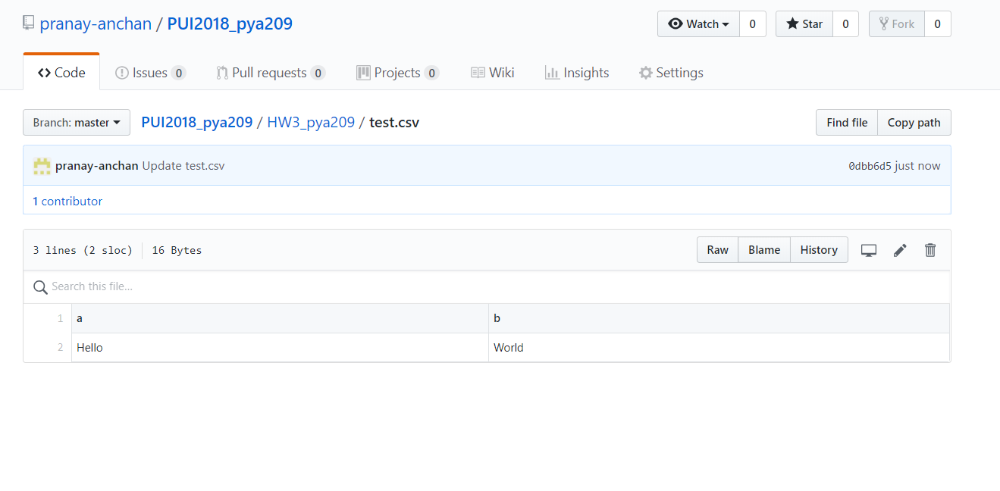
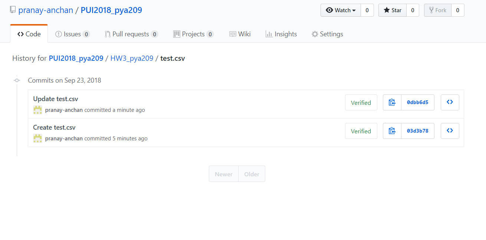

# Homework 3

--------------------------------------------

## Assingment 1

###### Screenshots showing file existence of test.csv and history

## Assignment 2 - Part 1

Went to NYC Open data and picked a dataset on Traffic Volume in NYC, using CSV data. Checked for environmental variable. Rendered table from the dataset and made some observations.

## Assignment 2 - Part 2

Used the same dataset as with previous task, but took JSON format. Plotted time as well.

## Assignment 3

Wrote a python script that takes the MTA key and bus route number as inputs and provides the bus name, number of vehicles and their current position as output. Did this by traversing the dictionary and printing appropriate fields.

## Assigment 4

Wrote a python script that takes the MTA key, bus route number and a csv file as inputs, and writes the latitude, longitude, next stop name and status into the csv file. 
Note: Had to use StopPointName and PresentableDistance fields as was getting no values in OnwardCalls.

