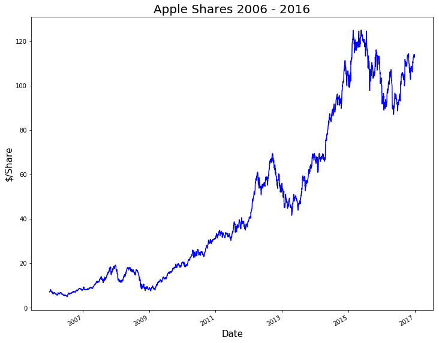

# Homework 8

## Assignment 1

Plotted Apple shares for 10 years (2006 - 2016). I got the idea from our ADS class.

The above plot shows the dollars per share for Apple for a period of 10 years (2006 - 2016). The various highs and lows can be attributed to real world events (for example the recession around 2008 - 2009).

**Note:** I have used fix_yahoo_finance library.

## Assignment 2

